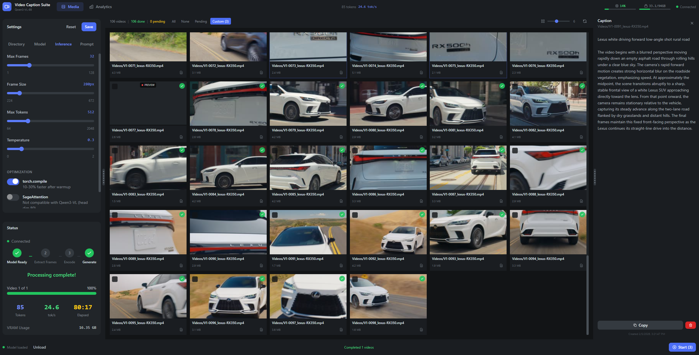

# Video Caption Suite

Batch video captioning using Qwen3-VL-8B vision-language model. Select a directory, process videos, get captions saved alongside them.



## Requirements

- Python 3.10+
- CUDA-capable GPU (8GB+ VRAM recommended)
- Node.js 18+ (for frontend build)

## Installation

**Windows:**
```
install.bat
```

**Linux/Mac:**
```
chmod +x install.sh
./install.sh
```

This creates a virtual environment and installs all dependencies.

## Usage

**Windows:**
```
start.bat
```

**Linux/Mac:**
```
./start.sh
```

Open http://localhost:8000 in your browser.

### Workflow

1. Click **Settings** and select your working directory
2. Videos from that directory appear in the grid
3. Select videos and click **Process**
4. Captions are saved as `.txt` files alongside the videos

## Configuration

Edit `config.py` to adjust:

| Setting | Default | Description |
|---------|---------|-------------|
| `MODEL_ID` | Qwen/Qwen3-VL-8B-Instruct | HuggingFace model |
| `MAX_FRAMES_PER_VIDEO` | 128 | Frames extracted per video |
| `FRAME_SIZE` | 336 | Frame dimension in pixels |
| `MAX_TOKENS` | 512 | Max caption length |
| `TEMPERATURE` | 0.3 | Generation creativity |

## Multi-GPU Processing

On systems with multiple CUDA GPUs, the suite automatically detects available devices and enables parallel processing:

- **Auto-detection**: GPUs are detected on startup via `/api/system/gpu`
- **Batch size**: Set how many videos to process simultaneously (1 per GPU, max 8)
- **Parallel workers**: Each GPU loads its own model copy and processes videos independently

The batch size slider appears in Settings → Optimization only when multiple GPUs are detected. Each GPU requires ~16GB VRAM to hold the Qwen3-VL-8B model.

## Project Structure

```
Video Caption Suite/
├── backend/          # FastAPI server
├── frontend/         # Vue 3 UI
├── models/           # Downloaded model cache
├── config.py         # Settings
├── install.bat/sh    # Installation
└── start.bat/sh      # Launch server
```

## License

MIT
